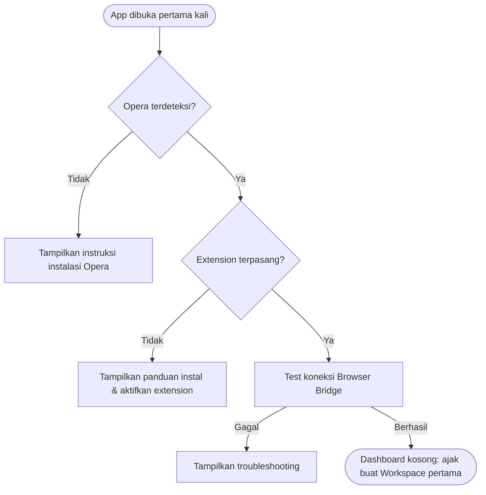
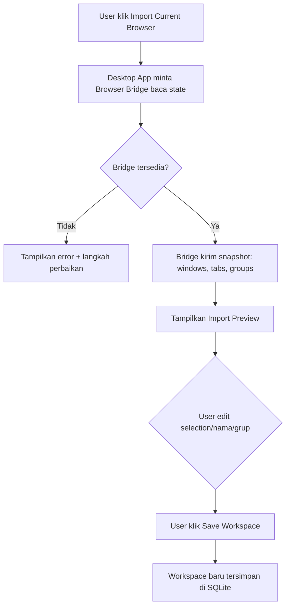
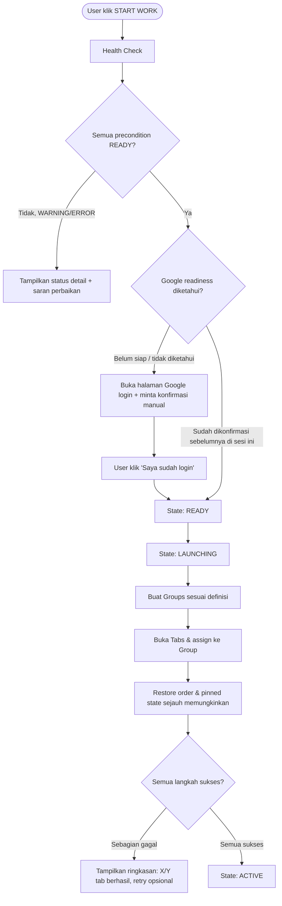
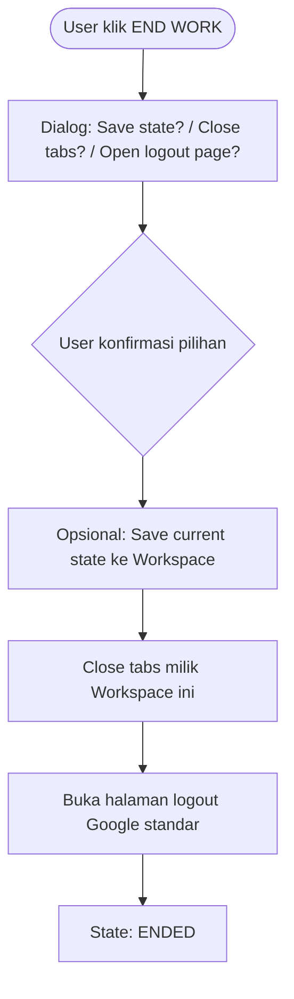
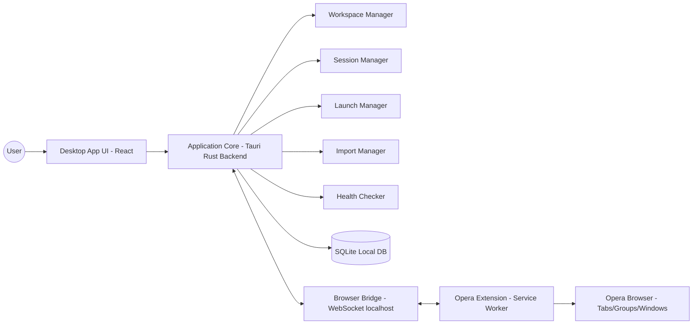
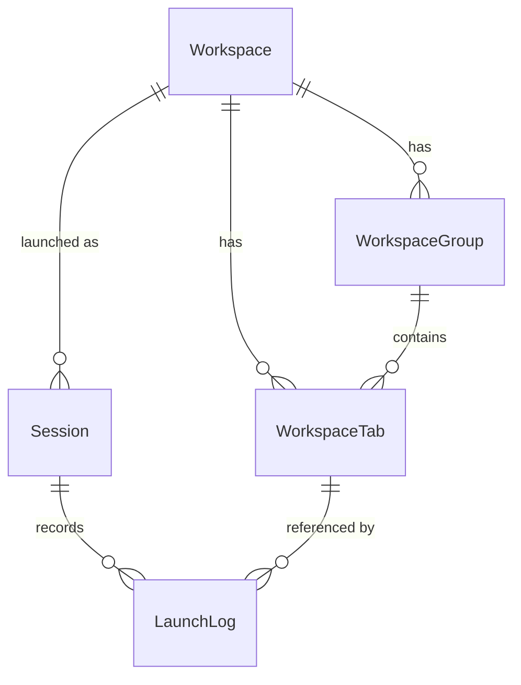
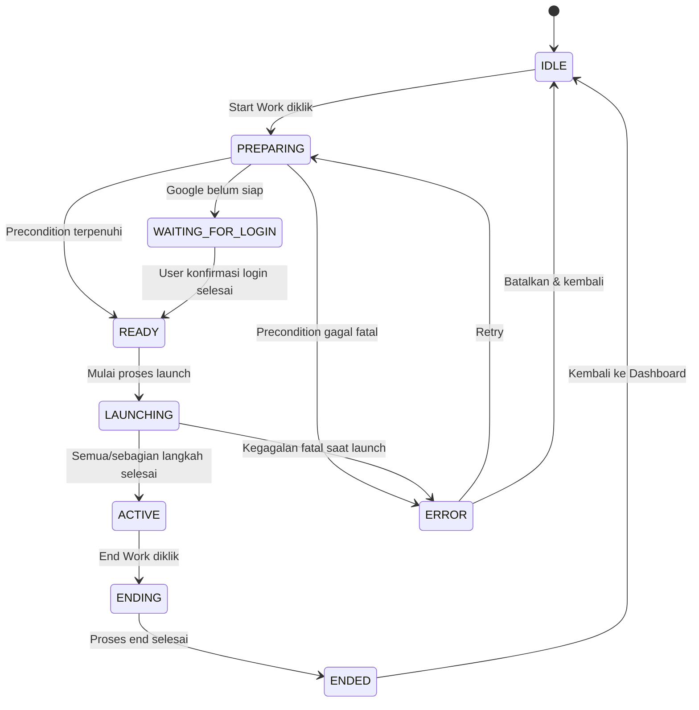

# PRD — WORKSPACE HUB
### Local-First Desktop App untuk Otomasi Lingkungan Kerja Browser (Opera)

**Status:** Draft v1.0 — Single Source of Truth
**Working Title:** Workspace Hub
**Target Platform:** Windows Desktop + Opera Browser Extension
**Dokumen ini ditulis untuk:** Product/Engineering Team & AI Coding Agent (Antigravity)

---

# 1. Executive Summary

Workspace Hub adalah aplikasi desktop **local-first** untuk Windows yang mengeliminasi workflow harian yang repetitif: membuka Opera, login Google, membuka puluhan tab kerja dalam beberapa tab group, memastikan semua tools yang dibutuhkan terbuka — dan di akhir shift, menutup semuanya kembali dengan rapi. Produk ini terdiri dari Desktop Application (Tauri + React), Opera Browser Extension (Manifest V3, berfungsi sebagai "Browser Bridge"), dan penyimpanan lokal (SQLite). Tidak ada cloud backend, tidak ada akun, dan yang **paling penting**: aplikasi tidak pernah menyimpan credential Google dalam bentuk apa pun, karena komputer digunakan bersama oleh beberapa orang.

Value inti produk adalah **one-click workspace restoration**: user memilih sebuah Workspace (mis. "CS NIGHT SHIFT") dan menekan **START WORK**, aplikasi akan membuka tab groups dan tab-tab yang telah dikonfigurasi sebelumnya, sejauh yang diizinkan oleh browser extension API. Di akhir kerja, **END WORK** menutup tab-tab tersebut dan mengarahkan user ke halaman logout Google secara manual (bukan otomatis dan bukan dengan menghapus cookie paksa).

Dokumen ini adalah kontrak teknis dan produk yang lengkap: mencakup arsitektur, data model, komunikasi, feasibility check untuk hal-hal yang belum pasti secara teknis, edge case, roadmap MVP → V1 → V2, dan panduan implementasi bertahap untuk Antigravity sebagai AI coding agent.

---

# 2. Product Vision

Menjadi cara tercepat dan paling aman bagi pekerja shift/multi-tasking yang menggunakan komputer bersama untuk **memulihkan** (bukan sekadar membuka) lingkungan kerja browser mereka — tanpa mengorbankan keamanan akun rekan kerja lain yang memakai komputer yang sama.

Workspace Hub tidak berusaha menjadi:
- Password manager.
- Session/cookie manager.
- Cloud sync tool.
- General-purpose tab manager untuk publik luas.

Workspace Hub berusaha menjadi:
- Personal automation layer di atas Opera yang dikontrol penuh secara lokal oleh user, non-destruktif, dan transparan soal apa yang dilakukannya.

---

# 3. Problem Statement

Pengguna bekerja di komputer kantor yang dipakai bergantian oleh beberapa rekan kerja. Setiap shift, pengguna harus secara manual: membuka Opera, login Google, membuka belasan–puluhan tab pekerjaan yang tersebar dalam beberapa kategori (Google tools, CS tools, tools lain), mengelompokkannya ke tab group, lalu di akhir shift menutup semuanya dan logout karena perangkat dipakai bersama.

Proses ini:
1. **Repetitif** — dilakukan setiap hari/shift.
2. **Memakan waktu** — puluhan langkah manual.
3. **Rawan human error** — tab atau tools tertentu sering terlupa dibuka, yang berdampak pada produktivitas kerja (mis. CS lupa membuka LiveChat).
4. **Berisiko keamanan** — karena device shared, tab dan sesi harus benar-benar ditutup rapi tiap akhir shift, dan ini juga manual sehingga rawan lupa.

Tidak ada solusi tab-manager umum di pasar yang dirancang khusus untuk pola "shared computer, shift-based, multi-group daily restoration" ini sambil tetap menjaga prinsip *no credential storage*.

---

# 4. Goals

| # | Goal | Metric Konseptual |
|---|------|--------------------|
| G1 | Mengurangi waktu persiapan lingkungan kerja harian | Dari puluhan langkah manual → 1–2 klik |
| G2 | Meniadakan tab/tool yang terlupa dibuka | Semua tab dalam Workspace terbuka konsisten setiap launch |
| G3 | Menjaga keamanan akun di komputer bersama | Zero credential storage, zero automatic credential manipulation |
| G4 | Memberikan kontrol penuh atas struktur workspace (group, tab, order) | User dapat mendefinisikan & mengedit workspace secara granular |
| G5 | Menjadi arsitektur yang dapat berkembang tanpa refactor besar | Modular desktop/extension/shared layer |

---

# 5. Non-Goals

Secara eksplisit **TIDAK** menjadi bagian dari produk (semua versi, kecuali dinyatakan sebaliknya di roadmap):

- Menyimpan atau mengelola password/credential apa pun.
- Sinkronisasi cloud / multi-device (bukan MVP; dipertimbangkan sebagai Future).
- Mendukung browser selain Chromium-based (Firefox tidak didukung, arsitektur berbasis WebExtension API Chromium).
- Mengotomasi login Google secara penuh (auto-fill, auto-submit credential).
- Mengelola user accounts / multi-tenant team workspace (Future, bukan MVP/V1).
- Menjadi general purpose password/session manager.
- Melakukan scraping/otomasi terhadap konten halaman kerja (mis. auto-fill data CS tools).

---

# 6. Target Users

Pengguna utama: pekerja kantoran yang menggunakan **komputer bersama (shared device)** dan menjalankan **shift kerja berulang** dengan banyak tab & tools browser, seperti staf Customer Service, Admin, dan Sales yang bekerja bergantian di satu unit komputer/workstation.

Karakteristik umum:
- Tidak selalu technical/power-user, tapi terbiasa dengan aplikasi produktivitas dasar.
- Menggunakan Google Workspace (Spreadsheet, Gmail) sebagai bagian penting dari workflow.
- Sensitif terhadap kecepatan (shift dimulai tepat waktu) dan terhadap keamanan akun pribadi mereka di device bersama.

---

# 7. User Personas

**Persona 1 — "Dinda", CS Night Shift Agent**
Bekerja shift malam, memakai komputer yang dipakai 2 shift lain di siang/sore hari. Setiap masuk shift ia harus membuka LiveChat, Dashboard CS, beberapa spreadsheet, dan Gmail tim. Ia butuh proses cepat karena shift dimulai ketat per jadwal, dan ia khawatir meninggalkan sesi Google-nya tetap login setelah shift selesai.

**Persona 2 — "Bagas", Admin/Sales Generalist**
Berpindah-pindah peran (admin di pagi hari, sales di sore hari) di komputer yang sama. Ia butuh beberapa Workspace berbeda (ADMIN, SALES) yang bisa di-switch cepat tanpa harus menyusun ulang tab setiap kali berganti peran.

**Persona 3 — "Rani", IT/Operator yang menyiapkan Workspace untuk tim**
Berperan menyiapkan template Workspace (mis. "CS NIGHT SHIFT") yang nantinya dipakai berulang oleh banyak staf shift. Ia butuh fitur Import Current Browser dan Workspace Editor yang detail agar konfigurasi bisa dibuat presisi sekali dan dipakai berkali-kali.

---

# 8. User Stories

| ID | As a... | I want to... | So that... | Priority |
|----|---------|---------------|------------|----------|
| US-01 | Shift worker | menekan satu tombol untuk membuka semua tab kerja saya | saya tidak perlu membuka satu per satu | P0 |
| US-02 | Shift worker | diarahkan untuk login Google secara manual jika belum login | saya tetap dalam kontrol penuh atas akun saya sendiri | P0 |
| US-03 | Shift worker | menyimpan konfigurasi browser saat ini sebagai Workspace | saya tidak perlu menyusun ulang dari nol | P0 |
| US-04 | Shift worker | mengimpor tab & group yang sedang terbuka menjadi Workspace baru | saya bisa membuat Workspace dari kondisi nyata, bukan menebak URL | P0 |
| US-05 | Shift worker | mengedit nama, urutan, dan grup dari tab-tab saya | Workspace saya tetap rapi sesuai kebutuhan | P0 |
| US-06 | Shift worker | menutup semua tab dan diarahkan ke halaman logout Google di akhir kerja | komputer bersih untuk shift berikutnya | P0 |
| US-07 | Shift worker | melihat status kesiapan lingkungan kerja sebelum mulai (Opera, extension, dsb) | saya tahu ada masalah sebelum saya mulai bekerja | P0 |
| US-08 | Admin/Sales | memiliki beberapa Workspace berbeda dan berpindah cepat antar Workspace | saya bisa menyesuaikan peran tanpa setup ulang | P0 |
| US-09 | Power user | mengekspor Workspace sebagai file dan mengimpornya kembali | saya punya backup dan bisa memindahkan konfigurasi | P1 |
| US-10 | Shift worker | mendapat notifikasi jelas jika sebagian tab gagal dibuka | saya tahu ada tools yang perlu saya buka manual | P0 |
| US-11 | Power user | menjalankan aplikasi dari system tray | aplikasi selalu siap tanpa membuka window utama | P1 |
| US-12 | Shift worker | memilih mode Static Workspace atau Remember Last State | saya bisa menentukan apakah Workspace saya tetap tetap atau ikut berubah mengikuti kondisi terakhir | P1 |

---

# 9. Product Principles

1. **Local-First** — Berfungsi penuh tanpa koneksi cloud/akun Workspace Hub.
2. **No Credential Storage** — Tidak pernah menyimpan password, cookie, token, atau session Google.
3. **Non-Destructive** — Tidak ada aksi destruktif tanpa konfirmasi jelas (close tabs, dsb).
4. **Workspace-Centric** — Unit utama adalah Workspace (kumpulan struktur group+tab), bukan sekadar daftar URL datar.
5. **Fast** — Setiap desain fitur dinilai dari seberapa banyak ia memangkas langkah manual harian.
6. **Maintainable** — Modular: UI logic, browser control logic, dan data layer dipisah tegas.
7. **Security-First** — Karena device shared, semua keputusan desain memprioritaskan tidak membuat mekanisme yang menyimpan authentication state sensitif apa pun.

---

# 10. Feature Map

```mermaid
flowchart TD
    A[Workspace Hub] --> B[Workspace Management]
    A --> C[Group Management]
    A --> D[Tab Management]
    A --> E[Import Current Browser]
    A --> F[One-Click Launch]
    A --> G[Session Management]
    A --> H[Save Current State]
    A --> I[End Work]
    A --> J[Health Check]
    A --> K[System Tray]
    A --> L[Backup / Export-Import]

    B --> B1[CRUD Workspace]
    B --> B2[Favorite/Archive/Reorder]
    C --> C1[CRUD Group]
    C --> C2[Group Color/Order]
    D --> D1[CRUD Tab]
    D --> D2[Pin/Reorder/Move]
    E --> E1[Read Browser State]
    E --> E2[Import Preview]
    F --> F1[Precheck]
    F --> F2[Launch Sequence]
    G --> G1[State Machine]
    H --> H1[Static Mode]
    H --> H2[Remember Last State]
    I --> I1[Close Tabs]
    I --> I2[Google Logout Redirect]
    J --> J1[Environment Check]
    K --> K1[Quick Actions]
    L --> L1[Export JSON]
    L --> L2[Import JSON]
```



---

# 11. Functional Requirements

Notasi prioritas: **P0** = MVP blocker, **P1** = Important (umumnya V1), **P2** = Nice to have, **P3** = Future.

## 11.1 Workspace Management (P0)
- FR-1.1 (P0) Create/Rename/Edit/Delete Workspace.
- FR-1.2 (P0) Setiap Workspace memiliki metadata: id, name, description, icon, color, created_at, updated_at, last_used_at, behavior_mode, browser_preference.
- FR-1.3 (P1) Duplicate Workspace.
- FR-1.4 (P1) Reorder Workspace (drag & drop di dashboard).
- FR-1.5 (P1) Favorite Workspace.
- FR-1.6 (P2) Archive Workspace (soft-hide, bukan delete).

## 11.2 Group Management (P0)
- FR-2.1 (P0) Create/Rename/Delete Group dalam sebuah Workspace.
- FR-2.2 (P0) Group memiliki color dan order.
- FR-2.3 (P1) Reorder Group.
- FR-2.4 (P1) Collapse/Expand group saat launch **[FEASIBILITY CHECK REQUIRED — bergantung pada dukungan `chrome.tabGroups.update({collapsed})` di Opera]**.
- FR-2.5 (P0) Assign tab ke group tertentu.

## 11.3 Tab Management (P0)
- FR-3.1 (P0) Add/Edit/Rename/Delete Tab di dalam Workspace Editor.
- FR-3.2 (P0) Tab menyimpan: name, url, group_id, position, pinned, optional metadata (mis. notes).
- FR-3.3 (P0) Reorder Tab (dalam group maupun antar group).
- FR-3.4 (P0) Move Tab ke group lain.
- FR-3.5 (P1) Open single tab dari Workspace Editor (untuk test cepat/preview).
- FR-3.6 (P0) Open all tabs (bagian dari Launch).

## 11.4 Import Current Browser (P0)
- FR-4.1 (P0) Membaca kondisi Opera saat ini: windows, tabs, urls, tab titles, group (jika tersedia), group name/color, posisi, pinned state.
- FR-4.2 (P0) Menampilkan Import Preview yang dapat diedit sebelum disimpan (pilih tab/group, ubah nama, ubah grup, batalkan sebagian).
- FR-4.3 (P0) Save hasil import sebagai Workspace baru.

## 11.5 One-Click Workspace Launch (P0)
- FR-5.1 (P0) Precondition check (Opera tersedia, Browser Bridge terkoneksi, workspace config valid).
- FR-5.2 (P0) Jika Google belum siap → arahkan user ke login manual, tunggu konfirmasi.
- FR-5.3 (P0) Create tab groups sesuai definisi Workspace.
- FR-5.4 (P0) Open tabs, assign ke group, restore ordering & pinned state sejauh API memungkinkan.
- FR-5.5 (P0) Tampilkan progress & hasil akhir (berapa tab berhasil/gagal).

## 11.6 Session Management (P0)
- FR-6.1 (P0) State machine sesi: IDLE → PREPARING → WAITING_FOR_LOGIN → READY → LAUNCHING → ACTIVE → ENDING → ENDED, dengan ERROR sebagai state paralel yang punya recovery path.
- FR-6.2 (P0) Hanya satu sesi ACTIVE yang direkomendasikan berjalan pada satu waktu (lihat Edge Case #26).

## 11.7 Save Current State (P0)
- FR-7.1 (P0) Simpan kondisi tab/group browser saat ini ke Workspace tertentu (overwrite terkontrol, dengan konfirmasi).
- FR-7.2 (P0) Pilihan behavior mode: **STATIC WORKSPACE** vs **REMEMBER LAST STATE** (lihat Section 14 untuk penjelasan penuh perbedaannya).

## 11.8 End Work (P0)
- FR-8.1 (P0) Dialog End Work menawarkan: Save current state (opsional), Close workspace tabs, Open Google logout page.
- FR-8.2 (P0) Tidak ada aksi yang mengambil password, menghapus cookie paksa, atau menyimpan session token.

## 11.9 Workspace Health Check (P0)
- FR-9.1 (P0) Cek status: Opera available, Browser Bridge connected, Extension available, Workspace config valid, Internet state, Google state (jika feasible).
- FR-9.2 (P0) Status ditampilkan sebagai: READY, WARNING, ERROR, UNKNOWN.

## 11.10 System Tray (P1)
- FR-10.1 (P1) Aplikasi dapat minimize ke tray dengan context menu: Start Workspace, Recent Workspace, Import Current Browser, Open Dashboard, Settings, Exit.
- *(Lihat Section 31 untuk justifikasi kenapa ini V1, bukan MVP.)*

## 11.11 Backup / Export (P0 untuk export dasar, P1 untuk fitur lanjutan)
- FR-11.1 (P0) Export Workspace individual ke file JSON.
- FR-11.2 (P0) Import Workspace dari file JSON hasil export, dengan validasi skema sebelum disimpan.
- FR-11.3 (P2) Export seluruh Workspace (bulk export) sekaligus.

---

# 12. Non-Functional Requirements

| Kategori | Requirement | Priority |
|---|---|---|
| Performance | Lihat target di Section 33 (Performance) | P0 |
| Security | Lihat Section 23 (Security Architecture) | P0 |
| Reliability | Aplikasi harus tetap dapat dibuka & workspace tetap dapat diedit meski Extension/Opera tidak tersedia (offline-editable) | P0 |
| Portability | Semua data lokal (SQLite file + config) harus mudah dipindahkan lewat backup/export | P1 |
| Maintainability | Kode terbagi jelas: `desktop/`, `extension/`, `shared/`; browser operation hanya lewat Browser Service | P0 |
| Accessibility | Kontras warna memadai (WCAG AA minimal untuk teks utama), keyboard navigable pada form-form utama | P2 |
| Localization | UI Bahasa Indonesia sebagai default (bisa disiapkan untuk multi-bahasa di masa depan, tidak wajib MVP) | P3 |

---

# 13. User Flows

Flow dijabarkan sebagai deskripsi langkah + diagram Mermaid untuk flow yang paling kritikal. Flow non-kritikal dijabarkan ringkas dalam bentuk poin agar dokumen tetap dapat digunakan.

### 13.1 First Launch & Initial Setup



### 13.2 Connect Browser Extension
1. User membuka Opera Extension store link yang disediakan aplikasi (atau via `opera://extensions` manual jika unpacked/dev build).
2. Extension terpasang, memunculkan badge status "Not Connected".
3. Extension mencoba koneksi WebSocket ke Desktop App.
4. Desktop App memvalidasi handshake token + origin extension ID.
5. Status berubah menjadi "Connected" di kedua sisi (badge extension & indikator Desktop App).

### 13.3 Create Workspace (manual, dari kosong)
Dashboard → "New Workspace" → isi nama/deskripsi/icon/color → masuk Workspace Editor kosong → user menambahkan Group → menambahkan Tab per Group → Save.

### 13.4 Import Current Browser



### 13.5 Start Work (Launch)



### 13.6 Workspace Launch Failure
Jika satu atau lebih tab/group gagal dibuat (network error, URL invalid, extension error), sesi tidak dibatalkan total. Sistem melanjutkan langkah tersisa, mencatat kegagalan, dan menampilkan ringkasan akhir dengan opsi "Retry Failed Items" per item.

### 13.7 End Work



### 13.8 Save Current State
Dari Session Center atau Dashboard, user memilih "Save Current Workspace" → sistem membaca state browser terkini terkait tab-tab milik Workspace aktif → menampilkan preview perubahan (diff sederhana: tab ditambah/dihapus/dipindah) → user konfirmasi → tersimpan.

### 13.9 Restore Session (setelah crash / restart aplikasi)
Saat Desktop App dibuka kembali, ia membaca `Session` terakhir dari SQLite. Jika status terakhir adalah ACTIVE/LAUNCHING dan Browser Bridge kini terkoneksi, tampilkan banner "Sesi sebelumnya mungkin masih berjalan di browser — Refresh Status?" (bukan auto-resume otomatis, karena state browser bisa sudah berubah sejak restart).

### 13.10 Export / Import Workspace
Export: Workspace Editor → "Export" → simpan file `.json` melalui native Save Dialog (Tauri dialog API).
Import: Dashboard → "Import Workspace" → pilih file → validasi skema (versi format, field wajib) → preview → simpan sebagai Workspace baru (tidak overwrite otomatis jika nama bentrok, minta rename/duplicate).

### 13.11–13.13 Extension Disconnected / Opera Not Found / Invalid URL
Dijabarkan detail di Section 26 (Edge Cases) karena sifatnya lebih ke penanganan error daripada flow linear.

### 13.14 Duplicate Tabs / Browser Already Has Existing Tabs
Saat launch, jika tab dengan URL sama sudah terbuka di window aktif, default behavior: **tidak membuka duplikat**, cukup fokus ke tab yang sudah ada (dicocokkan berdasarkan URL exact match). Perilaku ini dapat dimatikan di Workspace Preferences ("Always open new tab" toggle) — default OFF untuk MVP demi kesederhanaan; toggle full ditunda ke V1, MVP cukup 1 default behavior tetap.

---

# 14. UX/UI Specification

## 14.1 Arah Desain
Premium productivity tool — modern, clean, profesional, mendukung Dark Mode & Light Mode, layout responsif terhadap ukuran window desktop. Prioritas desain (urut): **usability > clarity > performance > visual polish**. Animasi/micro-interaction digunakan secukupnya untuk memberi feedback (loading, transisi state), bukan sebagai dekorasi.

## 14.2 STATIC WORKSPACE vs REMEMBER LAST STATE
Ini adalah keputusan behavior yang penting dan harus dijelaskan jelas ke user di UI (bukan cuma di dokumentasi):

| Aspek | STATIC WORKSPACE | REMEMBER LAST STATE |
|---|---|---|
| Definisi | Workspace selalu membuka konfigurasi yang persis sama seperti yang didefinisikan di Editor | Workspace memperbarui dirinya mengikuti kondisi terakhir sebelum di-End/Save |
| Kapan cocok | Workspace yang harus selalu konsisten (mis. template shift standar) | Workspace personal yang tab-nya sering berubah dinamis |
| Efek dari "Save Current State" | Tidak mengubah definisi Workspace kecuali user membuka Editor secara eksplisit dan menyimpan manual | Otomatis menawarkan update definisi setiap kali End Work / Save State dijalankan |
| Risiko | Bisa "usang" jika kebutuhan tab berubah tapi tidak diedit manual | Bisa "menumpuk sampah" jika user lupa membersihkan tab tidak relevan sebelum save |
| Default | Direkomendasikan sebagai default untuk Workspace shift/template | Cocok untuk Workspace pribadi/eksploratif |

## 14.3 Halaman Utama

### Dashboard
- **Purpose:** Pusat kendali — pilih & luncurkan Workspace, ringkasan status lingkungan.
- **Layout:** Header sapaan kontekstual (mis. "Selamat Malam, siap untuk shift?") + status bar kesiapan lingkungan (READY/WARNING/ERROR) + grid/list Workspace card + panel Quick Actions + Recent Workspaces.
- **Components:** WorkspaceCard (nama, jumlah tab, jumlah group, last used, tombol START WORK), HealthStatusBadge, QuickActionButton.
- **CTA utama:** START WORK pada card Workspace yang difavoritkan/terakhir dipakai.
- **Secondary actions:** New Workspace, Import Current Browser, Save Current Workspace, Settings.
- **Empty state:** Belum ada Workspace → ilustrasi + CTA "Buat Workspace pertama" atau "Import dari browser sekarang".
- **Loading state:** Skeleton card saat memuat daftar Workspace dari SQLite.
- **Error state:** Banner non-blocking jika Health Check gagal, tanpa menghalangi user membuka Workspace Editor (editing tetap bisa offline).
- **Success/Confirmation state:** Toast konfirmasi setelah launch berhasil, dengan ringkasan (mis. "10/10 tab berhasil dibuka").

### Workspace Detail
- **Purpose:** Melihat ringkasan sebuah Workspace sebelum membukanya/mengeditnya.
- **Layout:** Header metadata Workspace, daftar Group & Tab (read-only preview), tombol START WORK & Edit.
- **CTA:** START WORK.
- **Secondary:** Edit, Duplicate, Export, Delete (dengan konfirmasi).

### Workspace Editor
- **Purpose:** CRUD penuh Group & Tab dalam Workspace, drag & drop reorder.
- **Layout:** Kolom kiri daftar Group (collapsible), kolom kanan daftar Tab dalam Group terpilih; drag & drop antar group didukung.
- **Components:** GroupList, TabList, ColorPicker (group), URLInput dengan validasi format URL real-time, AddGroupButton, AddTabButton.
- **Interaksi:** Drag tab antar group memindahkan `group_id` & `position`; drag group mengubah `order`.
- **Empty state:** Group tanpa tab → placeholder "Tambahkan tab pertama".
- **Error state:** URL tidak valid → inline validation message, tidak block save keseluruhan (per-field validation).
- **Navigasi:** Breadcrumb kembali ke Dashboard/Workspace Detail; auto-save draft (debounced) + tombol Save eksplisit untuk konfirmasi akhir.

### Import Workspace (Import Current Browser)
- **Purpose:** Menyusun Workspace baru dari kondisi Opera saat ini.
- **Layout:** Panel kiri struktur asli (window/tab/group terbaca), panel kanan preview struktur yang akan disimpan (editable).
- **Interaksi:** Checkbox per tab/group untuk include/exclude, rename inline, pindah grup lewat dropdown/drag.
- **Loading state:** "Membaca kondisi browser..." dengan progress indikator karena bisa memakan waktu untuk banyak tab.
- **Error state:** Bridge tidak terkoneksi → CTA langsung ke troubleshooting Health Check.

### Session Center
- **Purpose:** Pusat kontrol sesi aktif — melihat status live, END WORK, retry failed items.
- **Layout:** Status besar (state machine saat ini), daftar tab yang berhasil/gagal dibuka, tombol END WORK, tombol Save Current State.
- **Empty state:** Tidak ada sesi aktif → arahkan ke Dashboard.

### Settings
- **Purpose:** Preferensi aplikasi & extension.
- **Layout:** Tab/section: General (tema, startup behavior), Browser (path Opera, Browser Bridge status & re-pair), Backup (export/import lokasi default), Diagnostics link.
- **Secondary:** Reset koneksi Browser Bridge, buka lokasi database.

### Diagnostics / About
- **Purpose:** Troubleshooting mandiri & transparansi versi.
- **Layout:** Versi app, versi extension terdeteksi, status koneksi real-time, tombol "Export Diagnostic Log" (dengan redaksi data sensitif — lihat Section 27).

---

# 15. Information Architecture

```
Dashboard (Home)
 ├─ Workspace Detail
 │   └─ Workspace Editor
 ├─ Import Workspace (Import Current Browser)
 ├─ Session Center
 ├─ Settings
 │   ├─ General
 │   ├─ Browser & Extension
 │   └─ Backup
 └─ Diagnostics / About
```

Navigasi bersifat hub-and-spoke dari Dashboard; Session Center dapat diakses cepat via persistent status indicator (mis. status bar/tray) selama ada sesi ACTIVE.

---

# 16. System Architecture

## 16.1 High-Level Architecture



## 16.2 Komponen Desktop App
- **React UI** — presentational + state binding, tidak berisi logic browser control.
- **Application Core (Rust/Tauri)** — orkestrasi seluruh manager di bawah ini.
- **Workspace Manager** — CRUD Workspace/Group/Tab, validasi data.
- **Session Manager** — mengelola state machine sesi (Section 24).
- **Launch Manager** — orkestrasi urutan perintah ke Browser Bridge saat Start Work.
- **Import Manager** — orkestrasi pembacaan state browser & transformasi ke Import Preview.
- **State Manager (frontend)** — state UI (React Context/Zustand-like store), sinkron dengan event dari backend via Tauri events.
- **Health Checker** — precondition checks (Section 30/status).
- **Settings** — preferensi lokal (file config terpisah dari data workspace, atau tabel `ApplicationSetting`).
- **Local Persistence Layer** — repository/service layer di atas SQLite, satu-satunya jalur akses DB (Guardrail #15).

## 16.3 Komponen Browser Extension
- **Browser Bridge (client-side)** — modul komunikasi ke Desktop App via WebSocket.
- **Tab Controller** — wrapper atas `chrome.tabs.*`.
- **Window Controller** — wrapper atas `chrome.windows.*`.
- **Group Controller** — wrapper atas `chrome.tabGroups.*` **[FEASIBILITY CHECK REQUIRED pada Opera]**, dengan fallback ke mode "flat tabs tanpa native grouping" jika API tidak tersedia (lihat Section 22).
- **Current Browser State Reader** — agregator snapshot state untuk Import.
- **Communication Layer** — service worker MV3 yang menjaga koneksi WebSocket, reconnect logic, message schema versioning.

## 16.4 Packaging & Deployment
- Desktop App dipaketkan sebagai installer Windows (`.msi`/`.exe` via Tauri bundler).
- Extension didistribusikan sebagai unpacked (dev/internal use) di MVP, dengan opsi Opera Add-ons store submission dipertimbangkan di V1 jika distribusi ke banyak staf diperlukan **[FEASIBILITY CHECK REQUIRED — kebijakan review store Opera untuk extension yang berkomunikasi ke aplikasi lokal perlu divalidasi]**.
- Auto-update: **tidak wajib MVP**; ditandai sebagai keputusan V1 (lihat Section 32).

## 16.5 Development & Production Environment
- Development: `pnpm`/`npm` workspace monorepo, Tauri dev server + extension loaded unpacked di `opera://extensions` (Developer Mode).
- Production: Tauri release build (code-signed jika tersedia sertifikat — jika tidak, tandai **FEASIBILITY CHECK REQUIRED** karena Windows SmartScreen dapat memblokir installer unsigned), extension dikemas sebagai `.crx`/packed zip.

---

# 17. Browser Extension Architecture

Extension berperan sebagai **Browser Bridge**, bukan aplikasi utama — seluruh business logic (validasi, penyimpanan, orkestrasi urutan) ada di Desktop App. Extension hanya:
1. Menerjemahkan perintah dari Desktop App menjadi panggilan WebExtension API.
2. Melaporkan state browser saat diminta atau saat event tertentu terjadi (mis. tab ditutup manual oleh user saat sesi ACTIVE).

### Struktur internal
- `background/service-worker.ts` — entrypoint MV3, menjaga koneksi Bridge, routing pesan.
- `background/tab-controller.ts`, `background/window-controller.ts`, `background/group-controller.ts` — modul terpisah per domain API.
- `background/state-reader.ts` — snapshot builder untuk Import & Health Check.
- `shared/message-schema.ts` — kontrak pesan (di-share dengan Desktop App lewat package `shared/`).

### Permissions
Dibahas detail di Section 21 (Permission Model) mengikuti prinsip least privilege.

### Deteksi & Reconnect
- Extension mencoba konek ke `ws://127.0.0.1:<port>` saat service worker aktif (event `onStartup`, `onInstalled`, dan saat popup dibuka).
- Reconnect dengan exponential backoff (mis. 1s, 2s, 4s, maksimal 30s) jika koneksi terputus.
- Badge icon extension merefleksikan status: Connected (hijau), Disconnected (abu-abu), Error (merah).

### Version Mismatch
- Setiap pesan handshake menyertakan `protocol_version`. Jika Desktop App dan Extension memiliki `protocol_version` yang tidak kompatibel, Desktop App menolak koneksi dan menampilkan pesan "Extension perlu diperbarui" (atau sebaliknya).

---

# 18. Communication Architecture

Ini adalah salah satu keputusan arsitektur paling kritikal produk. Berikut analisis opsi:

### OPTION A — Native Messaging
| Aspek | Penilaian |
|---|---|
| Pros | Mekanisme resmi Chromium untuk extension ↔ native app; tidak butuh membuka port network. |
| Cons | Lifecycle host dikendalikan oleh extension (`connectNative`), bukan Desktop App — bertentangan dengan kebutuhan Desktop App persistent/tray-controlled; butuh registrasi native host manifest terpisah di Windows Registry per browser; setiap perubahan path executable butuh update manifest; debugging lebih sulit (stdio-based). |
| Security | Baik — komunikasi lewat stdio, tidak exposed ke network lokal. |
| Complexity | Tinggi untuk kebutuhan bidirectional persistent app. |
| Opera Compatibility | Didukung karena berbasis Chromium, namun instalasi native host manifest perlu registry key spesifik Opera. |
| Maintainability | Sedang — instalasi/uninstalasi native host manifest menambah beban installer. |

### OPTION B — WebSocket localhost
| Aspek | Penilaian |
|---|---|
| Pros | Bidirectional, persistent connection, lifecycle sepenuhnya dikendalikan Desktop App (server dijalankan oleh Tauri backend); mudah diimplementasikan di kedua sisi; mudah untuk push event real-time (mis. laporan tab ditutup manual). |
| Cons | Membuka port di localhost — secara teori dapat diakses proses lokal lain di komputer yang sama (mitigasi: token handshake + origin validation, lihat Section 23). |
| Security | Baik jika dimitigasi dengan benar (bind ke `127.0.0.1` saja, token per-sesi/per-install, validasi `Origin` header = `chrome-extension://<known-id>`). |
| Complexity | Sedang — perlu implementasi WebSocket server (Rust, mis. `tokio-tungstenite`) dan client di service worker. |
| Opera Compatibility | Baik — WebSocket API standar tersedia di service worker MV3, meski service worker non-persistent memerlukan reconnect logic. |
| Maintainability | Baik — satu kanal jelas, mudah di-debug (bisa diuji dengan tool WebSocket generik). |

### OPTION C — HTTP localhost (REST/polling atau SSE)
| Aspek | Penilaian |
|---|---|
| Pros | Sangat sederhana, mudah didebug (`curl`-able), tidak butuh koneksi persistent. |
| Cons | Untuk event real-time butuh polling (latency lebih tinggi) atau SSE (satu arah saja, extension→app tetap butuh HTTP POST terpisah) — lebih rumit untuk pola bidirectional yang sering terjadi di produk ini (Desktop App mengirim banyak perintah berurutan saat launch, Extension melapor progress tiap tab). |
| Security | Sama seperti Option B, perlu token + origin validation. |
| Complexity | Rendah untuk request-response sederhana, naik untuk real-time bidirectional. |
| Opera Compatibility | Baik. |
| Maintainability | Baik untuk skala kecil. |

### OPTION D — Custom Protocol Handler (`workspacehub://`)
Bukan pengganti kanal utama; hanya cocok sebagai **pelengkap** untuk "wake/launch Desktop App dari luar" (mis. dari OS shortcut). Tidak mendukung komunikasi dua arah yang kaya.

### RECOMMENDED ARCHITECTURE
**Option B — WebSocket localhost**, dengan mitigasi keamanan wajib:
1. Server WebSocket dijalankan oleh Tauri backend, **bind hanya ke `127.0.0.1`**, port dapat dipilih dinamis dan ditulis ke file lokal yang hanya bisa dibaca user OS saat ini (mis. di bawah `%APPDATA%/WorkspaceHub/`).
2. Handshake token acak dibuat ulang tiap kali Desktop App start, disimpan di file yang sama, dibaca oleh extension lewat mekanisme yang tidak melibatkan network terbuka **[FEASIBILITY CHECK REQUIRED — perlu divalidasi cara extension MV3 membaca file lokal tersebut; kemungkinan besar butuh Native Messaging *hanya* untuk pertukaran token awal, sebagai hybrid approach]**.
3. Validasi `Origin` header pada setiap koneksi WebSocket masuk harus sama dengan Extension ID yang telah dikenal (disimpan saat pairing pertama).
4. Semua pesan divalidasi skema (lihat `shared/message-schema.ts`) sebelum dieksekusi; tidak ada eksekusi command string bebas (mencegah command injection, lihat Section 23).

Jika hasil FEASIBILITY CHECK menyimpulkan pertukaran token awal via file tidak reliable, fallback: gunakan **Native Messaging hanya untuk tahap pairing/handshake** (one-time, mengirim token), lalu channel utama tetap WebSocket. Ini disebut **Hybrid Bridge** dan ditandai sebagai keputusan yang perlu divalidasi di Feasibility Spike (Section 39).

---

# 19. Database Architecture

- Local persistence menggunakan **SQLite**, diakses eksklusif melalui Repository/Service Layer di Application Core (Guardrail #15) — UI React tidak pernah mengakses DB langsung.
- File database disimpan di direktori data aplikasi standar Windows (mis. `%APPDATA%/WorkspaceHub/workspacehub.db`).
- Migrasi skema dikelola lewat sistem migration bertahap (mis. `sqlx` migrations) agar update aplikasi tidak merusak data lama.
- **Mengapa SQLite dan bukan JSON file murni:** Meski skala data per user kecil (puluhan Workspace, ratusan Tab), SQLite memberi *transactional integrity* (penting untuk mencegah data corrupt saat aplikasi crash di tengah penulisan — lihat Edge Case #30), query relasional yang lebih mudah (mis. hitung jumlah tab per Workspace), dan jalur upgrade lebih mulus ke fitur masa depan (riwayat, search). JSON tunggal tetap dipertahankan, tapi hanya untuk **format Export/Import** (Section 11.11), bukan sebagai primary store.

---

# 20. Data Model

### Entities
`Workspace`, `WorkspaceGroup`, `WorkspaceTab`, `Session`, `ApplicationSetting`, `ExtensionRequirement`.

Entity tambahan yang diperlukan:
- **LaunchLog** — mencatat riwayat hasil launch (tab mana berhasil/gagal) untuk keperluan diagnostics & retry, terpisah dari `Session` agar `Session` tetap ringan sebagai representasi state machine murni.

### Skema

**Workspace**
| Field | Type | Key/Constraint | Nullable | Default |
|---|---|---|---|---|
| id | TEXT (UUID) | PK | No | — |
| name | TEXT | UNIQUE | No | — |
| description | TEXT | | Yes | NULL |
| icon | TEXT | | Yes | NULL |
| color | TEXT | | Yes | '#4F46E5' |
| behavior_mode | TEXT ENUM('static','remember_last') | | No | 'static' |
| browser_preference | TEXT | | Yes | 'opera' |
| is_favorite | BOOLEAN | | No | false |
| is_archived | BOOLEAN | | No | false |
| position | INTEGER | index | No | 0 |
| created_at | DATETIME | | No | now() |
| updated_at | DATETIME | | No | now() |
| last_used_at | DATETIME | | Yes | NULL |

**WorkspaceGroup**
| Field | Type | Key/Constraint | Nullable | Default |
|---|---|---|---|---|
| id | TEXT (UUID) | PK | No | — |
| workspace_id | TEXT | FK → Workspace.id (CASCADE DELETE) | No | — |
| name | TEXT | | No | — |
| color | TEXT | | No | 'grey' |
| position | INTEGER | index | No | 0 |
| collapsed_default | BOOLEAN | | No | false |

**WorkspaceTab**
| Field | Type | Key/Constraint | Nullable | Default |
|---|---|---|---|---|
| id | TEXT (UUID) | PK | No | — |
| workspace_id | TEXT | FK → Workspace.id (CASCADE DELETE) | No | — |
| group_id | TEXT | FK → WorkspaceGroup.id (SET NULL) | Yes | NULL |
| name | TEXT | | No | — |
| url | TEXT | | No | — |
| position | INTEGER | index | No | 0 |
| pinned | BOOLEAN | | No | false |
| metadata | TEXT (JSON) | | Yes | NULL |

**Session**
| Field | Type | Key/Constraint | Nullable | Default |
|---|---|---|---|---|
| id | TEXT (UUID) | PK | No | — |
| workspace_id | TEXT | FK → Workspace.id | No | — |
| state | TEXT ENUM(state machine, lihat Section 24) | index | No | 'idle' |
| started_at | DATETIME | | Yes | NULL |
| ended_at | DATETIME | | Yes | NULL |
| error_message | TEXT | | Yes | NULL |

**LaunchLog**
| Field | Type | Key/Constraint | Nullable | Default |
|---|---|---|---|---|
| id | TEXT (UUID) | PK | No | — |
| session_id | TEXT | FK → Session.id (CASCADE DELETE) | No | — |
| tab_id_ref | TEXT | FK → WorkspaceTab.id | No | — |
| status | TEXT ENUM('success','failed','skipped') | | No | — |
| error_detail | TEXT | | Yes | NULL |
| created_at | DATETIME | | No | now() |

**ApplicationSetting**
| Field | Type | Key/Constraint | Nullable | Default |
|---|---|---|---|---|
| key | TEXT | PK | No | — |
| value | TEXT (JSON) | | Yes | NULL |

**ExtensionRequirement**
| Field | Type | Key/Constraint | Nullable | Default |
|---|---|---|---|---|
| id | INTEGER | PK autoincrement | No | — |
| min_extension_version | TEXT | | No | — |
| protocol_version | TEXT | | No | — |
| updated_at | DATETIME | | No | now() |

### ERD



---

# 21. Security Architecture

## 21.1 Prinsip
Tidak ada penyimpanan credential dalam bentuk apa pun; seluruh komunikasi lokal divalidasi; semua aksi destruktif eksplisit dan dapat dikonfirmasi user.

## 21.2 Threat Model Ringkas

| Ancaman | Risiko | Mitigasi |
|---|---|---|
| Akses tidak sah ke local database | Rendah–Sedang (single-user OS profile, tapi device shared) | DB disimpan di profil user OS Windows saat ini (bukan folder shared); tidak menyimpan data sensitif (tidak ada credential) sehingga dampak kebocoran terbatas pada struktur workspace, bukan akun |
| Aplikasi lokal berbahaya lain menyadap WebSocket localhost | Sedang | Bind `127.0.0.1` saja, token handshake per-sesi, validasi `Origin` header sama dengan Extension ID terdaftar |
| Extension dikompromikan / dipalsukan | Sedang | Validasi Extension ID di sisi Desktop App; least privilege permission (Section 22); tidak ada eksekusi command arbitrary dari pesan extension |
| Command Injection lewat pesan WebSocket | Sedang–Tinggi jika tidak dimitigasi | Semua pesan divalidasi skema ketat (whitelist command type + payload shape), tidak ada `eval`/shell execution dari payload |
| Membuka URL arbitrary/berbahaya | Sedang | URL divalidasi format (harus `http`/`https`), tidak mengizinkan skema `file://`/`javascript:` dari data Workspace |
| Backup/Import workspace berbahaya (JSON dimanipulasi) | Sedang | Validasi skema JSON ketat sebelum import; batas jumlah field & panjang string; tidak ada field yang dieksekusi sebagai kode |
| Path traversal saat export/import file | Rendah | Gunakan native file dialog Tauri (user memilih lokasi eksplisit), tidak menerima path arbitrary dari input teks bebas |
| Privilege escalation dari extension ke OS | Rendah | Extension tidak pernah diberi kemampuan menjalankan proses OS; seluruh aksi sistem (jika ada di masa depan) hanya lewat Desktop App yang berjalan dengan privilege user biasa |
| Kebocoran data sensitif lewat logging | Sedang jika tidak dijaga | Lihat kebijakan logging di Section 27 — larangan eksplisit log password/cookie/token/konten halaman |

## 21.3 Batasan Tegas
Sesuai prinsip produk, sistem **tidak pernah**: membaca/menyimpan cookies Google, membaca password field, menghapus cookie secara paksa, menyimpan session token, atau mengambil alih credential dengan cara apa pun — termasuk untuk tujuan "deteksi login" (lihat Section 25 & Analysis Summary).

---

# 22. Permission Model

Prinsip: **least privilege** — setiap permission harus punya justifikasi fungsional langsung.

| Permission | Required/Optional | Justifikasi | Implikasi Keamanan |
|---|---|---|---|
| `tabs` | Required | Membaca/membuat/memindahkan/menutup tab sesuai definisi Workspace | Extension dapat melihat URL & title semua tab — risiko sedang, dibatasi hanya dipakai untuk fungsi inti, tidak dikirim ke luar device |
| `tabGroups` | Required (jika tersedia) | Membuat & mengatur tab group | **[FEASIBILITY CHECK REQUIRED di Opera]** — jika tidak tersedia, sistem fallback ke mode flat tabs tanpa native grouping (grouping hanya representasi visual di Workspace Hub, bukan native browser tab group) |
| `windows` | Required | Membaca & mengelola window untuk konteks multi-window | Rendah risiko |
| `storage` | Required | Menyimpan preferensi ringan sisi extension (mis. extension ID pairing, bukan credential) | Rendah risiko |
| `host_permissions` (`ws://127.0.0.1/*`) | Required | Koneksi ke Browser Bridge lokal | Dibatasi ke localhost saja, tidak broad host access |
| `cookies` | **Tidak digunakan** | — | Sengaja tidak diminta untuk menegakkan prinsip No Credential Storage |
| `webNavigation` | Optional (V1, jika dibutuhkan untuk deteksi state navigasi non-sensitif) | Hanya dipertimbangkan bila ada kebutuhan spesifik yang tervalidasi | Berpotensi dianggap invasive; harus dikaji ulang tiap kali diusulkan |
| `notifications` | Optional | Notifikasi native saat launch selesai (V1) | Rendah risiko |

---

# 23. Browser API Capability Matrix

| Capability | Required | Browser API | Opera Support | Risk | Fallback |
|---|---|---|---|---|---|
| Read tabs | Ya | `chrome.tabs.query` | Didukung (Chromium standar) | Rendah | — |
| Create tabs | Ya | `chrome.tabs.create` | Didukung | Rendah | — |
| Update tabs | Ya | `chrome.tabs.update` | Didukung | Rendah | — |
| Move tabs | Ya | `chrome.tabs.move` | Didukung | Rendah | — |
| Close tabs | Ya | `chrome.tabs.remove` | Didukung | Rendah | — |
| Read windows | Ya | `chrome.windows.getAll` | Didukung | Rendah | — |
| Create windows | Opsional | `chrome.windows.create` | Didukung | Rendah | Buka semua di window aktif jika multi-window tidak dibutuhkan MVP |
| Read groups | Ya | `chrome.tabGroups.query` | **FEASIBILITY CHECK REQUIRED** — indikasi awal riset menunjukkan dukungan tidak konsisten di Opera (ada laporan `chrome.tabGroups` undefined pada sebagian versi) | Tinggi | Mode "Virtual Group" — pengelompokan hanya di level data Workspace Hub (visual saja di Workspace Editor), tab dibuka berurutan tanpa native browser grouping |
| Create groups | Ya | `chrome.tabs.group` + `chrome.tabGroups.update` | Sama seperti di atas — **FEASIBILITY CHECK REQUIRED** | Tinggi | Sama seperti di atas |
| Update groups | Ya | `chrome.tabGroups.update` | **FEASIBILITY CHECK REQUIRED** | Tinggi | Sama seperti di atas |
| Move tabs into groups | Ya | `chrome.tabs.group({tabIds, groupId})` | **FEASIBILITY CHECK REQUIRED** | Tinggi | Sama seperti di atas |
| Detect active tab | Ya | `chrome.tabs.query({active:true})` | Didukung | Rendah | — |
| Detect browser availability | Ya | Deteksi proses via Desktop App (bukan extension API) — cek proses `opera.exe` berjalan | N/A (OS-level) | Sedang | Jika deteksi proses tidak reliable, gunakan status koneksi WebSocket sebagai proxy kesiapan (jika extension terkoneksi, Opera pasti berjalan) |
| Extension communication | Ya | WebSocket (custom, lihat Section 18) | Didukung (WebSocket API standar di service worker) | Sedang (lifecycle service worker non-persistent) | Reconnect logic + heartbeat |
| Google readiness detection | Diinginkan, tidak wajib teknis | Tidak ada API resmi yang aman | Tidak dapat dipastikan tanpa `cookies` permission | Tinggi | Manual user confirmation (default MVP) |

---

# 24. State Machine



Catatan implementasi: kegagalan **sebagian** (mis. 2 dari 15 tab gagal dibuka) **tidak** memicu transisi ke `ERROR` — sesi tetap lanjut ke `ACTIVE` dengan indikator warning dan opsi retry per item (dicatat di `LaunchLog`). `ERROR` disediakan khusus untuk kegagalan fatal (mis. Browser Bridge terputus total di tengah proses).

---

# 25. Error Handling

Prinsip umum: setiap error punya (1) pesan yang dapat dipahami user non-teknis, (2) opsi recovery yang jelas, (3) log detail teknis untuk diagnostics.

| Kategori Error | Contoh | User-Facing Message | Recovery |
|---|---|---|---|
| Environment Error | Opera tidak terdeteksi | "Opera belum terdeteksi di komputer ini." | Tautan bantuan instalasi |
| Bridge Error | WebSocket gagal konek | "Browser Bridge tidak terhubung." | Tombol "Coba Sambungkan Ulang" |
| Launch Partial Failure | 2 tab gagal dibuka | "13 dari 15 tab berhasil dibuka. 2 tab gagal." | Tombol "Coba Buka Ulang" per tab |
| Validation Error | URL tidak valid saat edit | "URL tidak valid, gunakan format http(s)://" | Inline correction, tidak block field lain |
| Data Integrity Error | DB corrupt saat startup | "Data workspace tidak dapat dibaca." | Tawarkan restore dari backup terakhir (jika ada) atau reset dengan konfirmasi eksplisit |
| Import Error | File backup rusak/format tidak dikenali | "File ini tidak dapat diimpor (format tidak dikenali)." | Batalkan, tidak menyentuh data existing |

Semua error diberi **error ID** unik (lihat Section 27) yang bisa disebutkan user ke support/IT internal tanpa perlu membaca log teknis.

---

# 26. Edge Cases

| # | Edge Case | Detection | Expected Behavior | User Feedback | Recovery | Data Integrity |
|---|---|---|---|---|---|---|
| 1 | Opera belum terbuka | Proses `opera.exe` tidak ditemukan | Desktop App menawarkan membuka Opera (via OS launch) | "Membuka Opera..." | Auto-retry Health Check setelah Opera terbuka | Tidak ada dampak |
| 2 | Opera sudah terbuka | Proses ditemukan | Lanjut ke pengecekan Bridge | — | — | — |
| 3 | Opera sudah memiliki tab lain | Snapshot state menunjukkan tab non-Workspace | Tab lain dibiarkan (non-destructive), tab baru ditambahkan di window yang sama | Info ringan, tidak mengganggu | — | Tidak ada dampak |
| 4 | Workspace yang sama sudah terbuka | Bandingkan URL aktif dengan definisi Workspace | Default: fokus ke tab existing, tidak duplikat (lihat 13.14) | "Beberapa tab sudah terbuka, difokuskan." | — | Tidak ada dampak |
| 5 | User sudah login Google | Tidak diverifikasi otomatis (lihat Section 25 kebijakan) | Lanjut tanpa blocking | — | — | — |
| 6 | User belum login Google | Sama seperti di atas — bergantung konfirmasi manual | Arahkan ke halaman login, tunggu konfirmasi | "Silakan login, lalu klik Lanjutkan." | User klik "Lanjutkan" | — |
| 7 | Google login state tidak dapat diverifikasi | By design (tidak ada API aman) | Selalu minta konfirmasi manual sebagai default | — | — | — |
| 8 | Browser Bridge tidak aktif | Heartbeat gagal | Blok Start Work, tampilkan status ERROR di Health Check | "Browser Bridge terputus." | Tombol reconnect | — |
| 9 | Extension disabled | Tidak ada koneksi masuk dari extension ID terdaftar dalam waktu tertentu | Sama seperti Bridge tidak aktif | "Extension tidak aktif." | Panduan aktifkan extension | — |
| 10 | Extension versi lama | `protocol_version` mismatch | Tolak koneksi, tampilkan pesan update | "Extension perlu diperbarui." | Tautan update | — |
| 11 | URL invalid | Validasi regex saat edit/import | Field ditandai error, tidak tersimpan sampai diperbaiki | Inline message | Edit langsung | Tidak ada dampak (validasi sebelum simpan) |
| 12 | URL tidak dapat diakses | Tab terbuka tapi gagal load (di luar kendali app) | Tab tetap terbuka apa adanya (bukan tanggung jawab app memverifikasi ketersediaan website) | Tidak ada error khusus dari app | — | — |
| 13 | Internet mati | Health Check network test gagal | Status WARNING, tetap izinkan membuka tab lokal/internal | "Koneksi internet tidak terdeteksi." | — | — |
| 14 | Workspace 50+ tab | Count saat launch | Tetap diproses, dengan batching agar UI responsif; tampilkan progress bar | Progress "23/54 tab dibuka" | — | — |
| 15 | Duplicate URL dalam 1 Workspace | Validasi saat save di Editor | Diizinkan tapi ditandai warning (soft warning, bukan blocking — user mungkin sengaja) | "Ada beberapa tab dengan URL sama." | — | — |
| 16 | Duplicate nama Group | Validasi saat save | Diizinkan tapi warning (nama group tidak wajib unik secara teknis) | Warning ringan | — | — |
| 17 | Tab gagal dibuka | Callback error dari `chrome.tabs.create` | Catat di `LaunchLog` sebagai `failed`, lanjut ke tab berikutnya | Ringkasan akhir | Retry per item | Log tercatat |
| 18 | Group gagal dibuat | Callback error dari `chrome.tabs.group` | Tab tetap dibuka tanpa group (fallback flat), dicatat warning | Ringkasan akhir | Retry | Log tercatat |
| 19 | Opera crash saat launch | Bridge terputus mendadak di tengah proses | Sesi masuk `ERROR`, progress terakhir tersimpan | "Opera berhenti merespons." | Retry dari titik terakhir (best-effort) atau restart penuh | `LaunchLog` menyimpan progress sebagian |
| 20 | Workspace Hub crash saat launch | App restart, baca `Session` terakhir | Tampilkan banner status tidak pasti (lihat 13.9) | "Sesi sebelumnya mungkin belum selesai." | User pilih refresh status / mulai ulang | Session state di DB tetap konsisten (transaksi) |
| 21 | User menutup tab manual saat ACTIVE | Event `chrome.tabs.onRemoved` dilaporkan Bridge | Update tampilan Session Center (tidak auto re-open, non-destructive terhadap keputusan user) | Info di Session Center | User bisa re-open manual dari Session Center | — |
| 22 | User mengubah group manual | Event terkait dilaporkan (opsional, non-blocking) | Tidak otomatis mengubah definisi Workspace kecuali user Save State eksplisit | — | — | — |
| 23 | User menambah tab baru manual | Sama seperti di atas | Tab baru tidak otomatis masuk Workspace kecuali Save State | — | — | — |
| 24 | User mengubah urutan tab manual | Sama | Tidak otomatis tersimpan | — | — | — |
| 25 | User membuka Workspace dua kali | Deteksi Session ACTIVE untuk Workspace yang sama | Tampilkan konfirmasi "Workspace ini sedang aktif, buka lagi?" | Dialog konfirmasi | User pilih lanjut/batal | — |
| 26 | Dua sesi berjalan sekaligus | Deteksi lebih dari satu `Session` berstatus ACTIVE | Diizinkan secara teknis (tidak dilarang keras), namun UI menampilkan peringatan potensi konflik tab | Warning banner | — | — |
| 27 | Computer restart | App tidak berjalan sampai dibuka lagi | Sesi terakhir tetap tersimpan sebagai riwayat, status ambigu ditandai | Banner saat app dibuka kembali | Refresh status | — |
| 28 | Windows sleep/wake | Bridge connection mungkin timeout | Reconnect otomatis via backoff logic | Badge status berubah sementara | Auto-reconnect | — |
| 29 | Extension reconnect | Setelah disconnect sementara | Resume normal, re-handshake token | Badge kembali hijau | — | — |
| 30 | Database corrupt | Query gagal saat startup dengan error integritas | Tawarkan restore dari backup lokal terakhir jika ada, atau mulai fresh dengan konfirmasi eksplisit | Dialog jelas, tidak silent-fail | Restore/backup manual oleh user | Mencegah silent data loss |
| 31 | Backup file corrupt | Validasi skema gagal saat import | Tolak import, tidak menyentuh data existing | "File backup tidak valid." | Coba file lain | Data existing aman |
| 32 | Hapus Workspace yang sedang aktif | Cek Session ACTIVE sebelum delete | Blok delete, minta End Work dulu | "Akhiri sesi terlebih dahulu sebelum menghapus Workspace ini." | End Work lalu delete | Mencegah state tidak konsisten |
| 33 | App ditutup saat Workspace sedang launching | Deteksi shutdown di tengah `LAUNCHING` | Simpan progress terakhir di `LaunchLog`/`Session`; saat dibuka lagi tampilkan status tidak pasti (seperti #20) | Banner status | Refresh/lanjutkan manual | Transaksi DB mencegah partial write yang rusak |

---

# 27. Logging & Diagnostics

- **Log levels:** `INFO`, `WARNING`, `ERROR` (dan `DEBUG` khusus development build, tidak aktif di production default).
- **Larangan mutlak dalam log:** password, cookies, authentication token, konten halaman (isi tab), URL query string yang berpotensi berisi token (di-redact bagian query string jika perlu, hanya simpan origin+path).
- **Log rotation:** file log harian, retensi maksimal 14 hari, ukuran maksimal per file dibatasi (mis. 5MB) dengan rotasi otomatis.
- **Log location:** `%APPDATA%/WorkspaceHub/logs/`.
- **Diagnostic export:** tombol di halaman Diagnostics yang mem-bundle log terbaru + info versi (app, extension, OS) ke satu file zip, dengan proses redaksi otomatis sebelum export (double-check, bukan hanya andalkan disiplin logging awal).
- **User-facing error ID:** setiap error fatal diberi ID pendek (mis. `WH-2201`) yang dapat dicari di log/dukungan internal tanpa user perlu memahami stack trace.

---

# 28. Backup & Restore

- **Export format:** JSON terstruktur berisi `schema_version`, metadata Workspace, Groups, Tabs (tanpa data Session/LaunchLog — backup hanya mencakup definisi, bukan riwayat).
- **Validasi Import:** cek `schema_version` kompatibel, cek field wajib per entity, batasi ukuran file & jumlah item untuk mencegah abuse (mis. maksimal beberapa ribu tab per file).
- **Konflik nama saat import:** tidak overwrite otomatis; tawarkan "Simpan sebagai baru" (rename otomatis dengan suffix) atau "Batalkan".
- **Restore dari corrupt DB:** jika tersedia file export terakhir (jika user pernah melakukan export), tawarkan restore dari sana; jika tidak, tampilkan opsi mulai fresh dengan peringatan jelas bahwa data lama tidak dapat dipulihkan (karena memang tidak ada mekanisme backup otomatis di MVP — lihat Section 31 untuk apa yang di luar MVP).

---

# 29. Testing Strategy

| Jenis Test | Cakupan |
|---|---|
| Unit Test | Repository/service layer (Workspace/Group/Tab CRUD), validasi skema pesan, validasi URL, state machine transitions |
| Integration Test | Application Core ↔ SQLite (migration, transaksi), Application Core ↔ Browser Bridge (mock WebSocket client) |
| Extension Test | Tab/Window/Group Controller terhadap mock `chrome.*` API |
| Browser Integration Test | Extension nyata terhadap Opera nyata (manual/semi-otomatis, karena WebExtension API sulit di-headless-test penuh) |
| E2E Test | Skenario penuh: Import → Save → Start Work → End Work, dijalankan di lingkungan Opera nyata |
| Manual QA | Checklist edge case (Section 26), regresi visual UI |
| Failure Recovery Test | Simulasi Bridge terputus di tengah launch, DB corrupt, App crash saat launching |

### Contoh Test Case
- **Create workspace:** Buat Workspace baru dengan 2 group & 5 tab → verifikasi tersimpan dengan `position` benar.
- **Import tabs:** Buka 3 window dengan total 10 tab → Import Current Browser → verifikasi snapshot mencerminkan struktur asli.
- **Launch workspace:** Workspace dengan 3 group, 12 tab → Start Work → verifikasi seluruh tab terbuka dengan group & pinned state sesuai (atau fallback flat jika tabGroups tidak tersedia).
- **Group creation:** Verifikasi perilaku saat `chrome.tabGroups` tersedia vs tidak tersedia (fallback path harus diuji eksplisit).
- **Tab movement:** Pindahkan tab antar group di Editor → verifikasi `group_id` & `position` ter-update benar di DB.
- **Google login flow:** Simulasikan status "belum siap" → verifikasi UI menampilkan langkah manual dan tidak melanjutkan tanpa konfirmasi user.
- **Extension disconnect:** Putuskan koneksi WebSocket paksa saat `ACTIVE` → verifikasi Session Center menampilkan status terputus tanpa merusak data Workspace.
- **Opera closed:** Tutup proses Opera saat sesi `LAUNCHING` → verifikasi transisi ke `ERROR` dengan log tercatat.
- **Duplicate workspace launch:** Start Work dua kali pada Workspace sama → verifikasi dialog konfirmasi muncul (Edge Case #25).
- **Crash recovery:** Kill proses Desktop App saat `LAUNCHING` → buka ulang → verifikasi banner status ambigu muncul, data tidak korup.
- **Backup/restore:** Export Workspace → hapus Workspace → Import kembali → verifikasi data identik.

---

# 30. Acceptance Criteria

**AC-1 — Start Work (kondisi ideal)**
Given: Opera berjalan dan Browser Bridge terkoneksi, Workspace valid.
When: User klik START WORK.
Then: Workspace Hub membuka seluruh group dan tab sesuai definisi, dan Session berpindah ke ACTIVE dengan ringkasan "N/N tab berhasil".

**AC-2 — Start Work dengan Google belum siap**
Given: Health Check menunjukkan status Google readiness tidak diketahui.
When: User klik START WORK.
Then: Aplikasi membuka halaman login Google dan menunggu user menekan "Saya sudah login" sebelum melanjutkan ke LAUNCHING.

**AC-3 — Import Current Browser**
Given: Browser Bridge terkoneksi dan Opera memiliki minimal 1 window dengan tab terbuka.
When: User memilih Import Current Browser.
Then: Import Preview menampilkan struktur tab/group yang sesuai dengan kondisi nyata browser, dan dapat diedit sebelum disimpan sebagai Workspace baru.

**AC-4 — Tab Group Fallback**
Given: `chrome.tabGroups` API tidak tersedia/reliable di Opera (hasil Feasibility Check negatif).
When: User menjalankan Start Work pada Workspace yang punya struktur group.
Then: Seluruh tab tetap terbuka dengan urutan sesuai definisi, tanpa native browser grouping, dan UI Workspace Hub tetap menampilkan pengelompokan secara visual di levelnya sendiri.

**AC-5 — End Work**
Given: Session berstatus ACTIVE.
When: User klik END WORK dan mengonfirmasi "Close tabs" + "Open Google logout page".
Then: Seluruh tab milik Workspace tersebut ditutup, halaman logout Google standar terbuka, dan Session berpindah ke ENDED — tanpa satu pun aksi yang menghapus cookie atau menyimpan credential.

**AC-6 — Non-Destructive Save**
Given: User memiliki Workspace dengan definisi tertentu dan sedang menjalankan Save Current State.
When: User membatalkan konfirmasi di dialog preview perubahan.
Then: Definisi Workspace tidak berubah sama sekali.

**AC-7 — Extension Disconnected Mid-Session**
Given: Session berstatus ACTIVE dan koneksi Bridge terputus.
When: Sistem mendeteksi heartbeat gagal.
Then: UI menampilkan status disconnected secara jelas, tanpa menghapus/merusak data Session atau Workspace yang sudah tersimpan.

---

# 31. MVP Scope

## Termasuk MVP
1. Desktop App (Tauri + React) dengan Dashboard, Workspace Detail, Workspace Editor, Import Workspace, Session Center, Settings, Diagnostics.
2. Opera Extension (Manifest V3) sebagai Browser Bridge dengan Tab/Window/Group Controller (Group Controller dengan fallback flat jika diperlukan).
3. Workspace CRUD penuh + Group + Tab CRUD, reorder, pinned state.
4. Import Current Browser dengan Import Preview yang dapat diedit.
5. One-Click Launch (Start Work) dengan precondition check.
6. Session Management dasar (state machine penuh, tanpa fitur lanjutan seperti multi-session analytics).
7. Save Current State (kedua mode: Static & Remember Last State).
8. End Work dengan dialog non-destruktif (close tabs + arahkan logout manual).
9. Workspace Health Check dasar (Opera, Bridge, config valid, internet).
10. Local persistence penuh via SQLite.
11. Backup/Export & Import per-Workspace (format JSON).
12. Error handling & logging dasar sesuai Section 25 & 27.

## TIDAK Termasuk MVP
- System Tray & Quick Actions dari tray (→ **V1**, lihat CONCERN di Analysis Summary).
- Auto-start saat Windows boot (→ V1/V2).
- Keyboard shortcuts global (→ V1).
- Workspace templates siap pakai (→ V1).
- Multi-window workspace penuh (→ V1/V2, MVP fokus single-window per Workspace).
- Deteksi otomatis Google login (→ tidak direncanakan sama sekali kecuali hasil riset V1 menunjukkan cara yang benar-benar aman; lihat CONCERN Analysis Summary).
- Auto-update aplikasi (→ V1).
- Cloud backup / multi-device sync (→ Future, bertentangan dengan prinsip Local-First kecuali didesain ulang sebagai opt-in eksplisit).
- Team/shared workspace lintas user (→ Future).
- Analytics penggunaan (→ Future, dan harus tetap sejalan prinsip privacy-first jika suatu saat dipertimbangkan).

---

# 32. V1 Roadmap

| Fitur | Value | Complexity | Justifikasi |
|---|---|---|---|
| System Tray + Quick Actions | Tinggi | Sedang | Memangkas langkah "buka app dulu" — value tinggi untuk workflow harian |
| Auto-start saat Windows boot | Sedang | Rendah | Melengkapi tray agar app selalu siap |
| Keyboard shortcuts (mis. buka Session Center) | Sedang | Rendah | Power-user convenience |
| Workspace templates | Sedang | Sedang | Mempercepat setup Workspace baru untuk staf baru |
| Auto-update aplikasi | Sedang | Sedang–Tinggi | Penting untuk distribusi ke banyak staf tanpa reinstall manual |
| Advanced restore (retry granular, partial re-launch pintar) | Sedang | Sedang | Mengurangi friksi saat sebagian tab gagal |
| Multi-window workspace | Sedang | Tinggi | Berguna untuk role yang butuh dua monitor/dua window kerja |
| Native grouping via Native Messaging hybrid (jika WebSocket-only terbukti kurang, lihat Section 18) | Tinggi (jika diperlukan) | Tinggi | Bergantung hasil Feasibility Spike |

## V2
- Workspace history (riwayat perubahan Workspace, bukan hanya Session log).
- Notifikasi native lanjutan & integrasi lebih dalam dengan Windows (toast actionable).
- Opsional: heuristik non-invasif untuk membantu (bukan menggantikan) konfirmasi login, jika tervalidasi aman.

## Future (butuh keputusan produk ulang, bukan sekadar penambahan fitur)
- Cloud backup opsional (opt-in eksplisit, tetap tanpa credential storage).
- Multi-device sync.
- Team workspace (berbagi definisi Workspace antar staf secara terkelola, bukan share credential).
- Advanced automation (mis. integrasi trigger dari tools eksternal).

**Catatan:** Fitur seperti "Analytics" dan "Advanced automation" sengaja tidak dijabarkan detail karena tidak ada kebutuhan tervalidasi saat ini — dijaga agar roadmap tidak "terlihat banyak" tanpa alasan (sesuai instruksi awal).

---

# 33. Development Phases

Setiap fase dirancang agar dapat diberikan ke Antigravity secara bertahap, dengan boundary jelas agar AI coding agent tidak menebak requirement.

### PHASE 0 — Project Setup
- **Goal:** Monorepo siap, tooling dasar berjalan.
- **Files/modules:** `/desktop`, `/extension`, `/shared`, `/docs`, root config (linting, TypeScript config, CI dasar).
- **Dependencies:** Tidak ada dependency eksternal fungsional, hanya tooling.
- **Features:** Struktur folder, `package.json`/workspace config, README pengembangan.
- **Acceptance criteria:** `pnpm install` berhasil di root, kedua sub-project (`desktop`, `extension`) dapat build kosong tanpa error.
- **Testing:** Build smoke test.
- **Risks:** Salah struktur folder di awal akan menyulitkan fase berikutnya — validasi dengan Section 38.
- **Definition of Done:** Monorepo bisa di-clone & build dari nol oleh developer baru mengikuti README.

### PHASE 1 — Desktop Shell
- **Goal:** Aplikasi Tauri + React dasar tampil (window kosong, navigasi dasar antar halaman placeholder).
- **Files/modules:** `desktop/src-tauri`, `desktop/src/app` (routing), `desktop/src/pages/*` (placeholder).
- **Dependencies:** Tauri, React, router.
- **Features:** Window utama terbuka, routing antar halaman placeholder (Dashboard/Settings/dll kosong).
- **Acceptance criteria:** App terbuka di Windows, navigasi antar halaman placeholder berfungsi.
- **Testing:** Manual smoke test build Windows.
- **Risks:** Konfigurasi bundler Tauri untuk Windows perlu divalidasi awal.
- **Definition of Done:** Installer dev build berjalan di Windows tanpa crash.

### PHASE 2 — Local Database
- **Goal:** SQLite terhubung, migration awal untuk seluruh entity Section 20.
- **Files/modules:** `desktop/src-tauri/src/db`, migration files.
- **Dependencies:** SQLite driver (mis. `sqlx`).
- **Features:** Migration schema penuh (Workspace, Group, Tab, Session, LaunchLog, ApplicationSetting, ExtensionRequirement).
- **Acceptance criteria:** DB file dibuat otomatis saat first run, migration idempotent.
- **Testing:** Unit test migration up/down (jika reversible), test koneksi.
- **Risks:** Perubahan skema di fase lanjut harus lewat migration baru, bukan edit file lama (Guardrail).
- **Definition of Done:** Semua tabel Section 20 tersedia dan dapat diquery lewat repository layer dasar.

### PHASE 3 — Workspace CRUD
- **Goal:** Repository/service layer + UI penuh untuk Workspace/Group/Tab CRUD (tanpa browser control sama sekali).
- **Files/modules:** `desktop/src-tauri/src/workspace_manager`, `desktop/src/pages/Dashboard`, `WorkspaceEditor`.
- **Dependencies:** Phase 2.
- **Features:** FR-1.x, FR-2.x, FR-3.x (Section 11.1–11.3) minus fungsi yang butuh browser.
- **Acceptance criteria:** User dapat membuat Workspace, group, tab, reorder, simpan — sepenuhnya offline, tanpa Opera terbuka.
- **Testing:** Unit test repository, UI test dasar form validation.
- **Risks:** Desain skema Editor (drag & drop) perlu divalidasi UX sebelum banyak state ditambahkan.
- **Definition of Done:** AC terkait CRUD di Section 30 (bagian yang tidak butuh browser) terpenuhi.

### PHASE 4 — Browser Extension (skeleton)
- **Goal:** Extension MV3 dasar terpasang di Opera, dapat membaca tab/window (belum terhubung ke Desktop App).
- **Files/modules:** `extension/src/background`, `extension/manifest.json`.
- **Dependencies:** Phase 0.
- **Features:** Tab/Window Controller dasar, badge status dummy.
- **Acceptance criteria:** Extension terpasang unpacked di Opera, dapat query tab aktif dan menampilkan di popup sederhana.
- **Testing:** Manual test di Opera nyata.
- **Risks:** Validasi awal ketersediaan `chrome.tabGroups` **harus dilakukan di fase ini** sebagai bagian dari Feasibility Spike (Section 39) sebelum Phase 5 dimulai.
- **Definition of Done:** Extension terpasang & dapat membaca tabs/windows nyata.

### PHASE 5 — Browser Communication
- **Goal:** WebSocket Bridge dua arah antara Desktop App dan Extension, dengan handshake token & validasi origin.
- **Files/modules:** `desktop/src-tauri/src/bridge`, `extension/src/background/bridge-client.ts`, `shared/message-schema.ts`.
- **Dependencies:** Phase 1, Phase 4.
- **Features:** Section 18 (Recommended Architecture) diimplementasikan penuh, termasuk reconnect logic.
- **Acceptance criteria:** Status koneksi tampil real-time di kedua sisi (Desktop App & extension badge).
- **Testing:** Integration test dengan mock client, manual test disconnect/reconnect.
- **Risks:** Hasil Feasibility Spike terkait pertukaran token (Section 18, poin 2) menentukan apakah dibutuhkan Hybrid Bridge — evaluasi sebelum lanjut ke Phase 7.
- **Definition of Done:** Koneksi stabil, reconnect otomatis berfungsi setelah simulasi disconnect.

### PHASE 6 — Import Current Browser
- **Goal:** Snapshot state browser → Import Preview → Save sebagai Workspace.
- **Files/modules:** `desktop/src-tauri/src/import_manager`, `desktop/src/pages/ImportWorkspace`, `extension/src/background/state-reader.ts`.
- **Dependencies:** Phase 3, Phase 5.
- **Features:** FR-4.x (Section 11.4).
- **Acceptance criteria:** AC-3 (Section 30) terpenuhi.
- **Testing:** E2E manual dengan Opera nyata berisi banyak tab/window.
- **Risks:** Jika Group API tidak tersedia (hasil Feasibility Spike), Import tetap harus berfungsi tanpa data group native (fallback ke flat list).
- **Definition of Done:** Import menghasilkan Workspace yang akurat mencerminkan kondisi nyata (minus grouping jika fallback aktif).

### PHASE 7 — Workspace Launch
- **Goal:** Start Work penuh sesuai Section 13.5 & state machine Section 24.
- **Files/modules:** `desktop/src-tauri/src/launch_manager`, `extension/src/background/tab-controller.ts` + `group-controller.ts`.
- **Dependencies:** Phase 5, Phase 6.
- **Features:** FR-5.x.
- **Acceptance criteria:** AC-1, AC-2, AC-4 (Section 30).
- **Testing:** E2E dengan berbagai ukuran Workspace (kecil & 50+ tab), failure injection test.
- **Risks:** Performa saat 50+ tab (lihat Section 33 Performance) perlu diukur nyata di fase ini.
- **Definition of Done:** Launch berfungsi konsisten dengan ringkasan hasil akurat, termasuk skenario partial failure.

### PHASE 8 — Session Management
- **Goal:** Session Center penuh, End Work, Save Current State (kedua mode).
- **Files/modules:** `desktop/src/pages/SessionCenter`, `desktop/src-tauri/src/session_manager`.
- **Dependencies:** Phase 7.
- **Features:** FR-6.x, FR-7.x, FR-8.x.
- **Acceptance criteria:** AC-5, AC-6, AC-7.
- **Testing:** Test end-to-end siklus penuh Start Work → End Work.
- **Risks:** Static vs Remember Last State perlu UX testing agar tidak membingungkan user awam.
- **Definition of Done:** Siklus kerja harian penuh (start–end) berjalan tanpa aksi destruktif tak terduga.

### PHASE 9 — Health Check
- **Goal:** Precondition check menyeluruh sebelum Start Work + halaman Diagnostics dasar.
- **Files/modules:** `desktop/src-tauri/src/health_checker`.
- **Dependencies:** Phase 5.
- **Features:** FR-9.x.
- **Acceptance criteria:** Status READY/WARNING/ERROR/UNKNOWN akurat merefleksikan kondisi nyata.
- **Testing:** Test tiap kondisi (Opera mati, Bridge putus, config invalid, dsb).
- **Risks:** Deteksi proses Opera di Windows perlu divalidasi reliabilitasnya.
- **Definition of Done:** Semua Edge Case terkait environment (Section 26, #1–#13) tertangani sesuai tabel.

### PHASE 10 — UI Polish
- **Goal:** Dark/Light mode, micro-interaction, empty/loading/error states konsisten di semua halaman.
- **Files/modules:** `desktop/src/theme`, komponen shared UI.
- **Dependencies:** Semua phase UI sebelumnya.
- **Features:** Section 14 penuh.
- **Acceptance criteria:** Semua halaman di Section 14.3 memenuhi spesifikasi state (empty/loading/error/success).
- **Testing:** Visual regression manual, review UX checklist.
- **Risks:** Jangan over-polish sebelum fungsi inti stabil (guardrail prioritas).
- **Definition of Done:** Semua halaman utama konsisten secara visual & interaktif sesuai Section 14.

### PHASE 11 — Testing
- **Goal:** Menutup seluruh Testing Strategy (Section 29) sebelum rilis MVP.
- **Files/modules:** Test suite lengkap di `desktop/tests`, `extension/tests`.
- **Dependencies:** Semua phase sebelumnya.
- **Features:** Automasi unit/integration test, checklist manual QA edge case penuh.
- **Acceptance criteria:** Semua Acceptance Criteria Section 30 lulus, semua Edge Case Section 26 tervalidasi manual minimal sekali.
- **Testing:** — (ini adalah fase testing itu sendiri).
- **Risks:** Edge case terkait crash recovery butuh waktu ekstra untuk disimulasikan dengan andal.
- **Definition of Done:** Checklist QA penuh hijau, tidak ada P0 bug terbuka.

### PHASE 12 — Packaging
- **Goal:** Installer Windows siap distribusi, extension siap dipasang (unpacked/internal untuk MVP).
- **Files/modules:** Konfigurasi Tauri bundler, dokumentasi instalasi.
- **Dependencies:** Phase 11.
- **Features:** Section 16.4.
- **Acceptance criteria:** Installer berjalan di komputer Windows bersih (belum pernah ada dependency dev), extension dapat dipasang mengikuti panduan.
- **Testing:** Fresh install test di mesin/VM bersih.
- **Risks:** Code signing belum tentu tersedia — tandai **FEASIBILITY CHECK REQUIRED** untuk keputusan mitigasi SmartScreen warning.
- **Definition of Done:** MVP dapat diinstal & dijalankan end-to-end oleh user non-teknis mengikuti panduan tertulis.

---

# 34. Antigravity Coding Guidelines (Coding Guardrails)

1. Jangan rewrite working modules tanpa alasan teknis yang didokumentasikan.
2. Jangan menghapus existing functionality tanpa persetujuan eksplisit di luar scope task yang diberikan.
3. Jangan membuat dependency baru tanpa alasan jelas dan dicatat di Decision Log (Section 38).
4. Jangan menyimpan credential dalam bentuk apa pun (password, cookie, token, session).
5. Jangan hard-code password/token/secret apa pun di source code.
6. Jangan mengasumsikan browser API tersedia — selalu cek hasil Feasibility Check terkait sebelum implementasi (khususnya `chrome.tabGroups` di Opera).
7. Jangan membuat database online/cloud untuk MVP.
8. Gunakan TypeScript strict mode di seluruh kode `desktop/src` dan `extension/src`.
9. Gunakan modular architecture — satu modul, satu tanggung jawab (lihat pemetaan Section 16.2–16.3).
10. Setiap feature harus dapat diuji secara terpisah (unit-testable), hindari kopling erat antar manager.
11. Jangan melakukan destructive browser action (close tabs, dsb) tanpa explicit user-confirmed flow sesuai Section 13.7/26.
12. Jangan membuat massive single-file architecture — pisahkan per domain (workspace, session, launch, import, health, bridge).
13. Jangan mencampurkan UI logic dengan browser control logic — UI React hanya memanggil Application Core lewat Tauri command, tidak pernah memanggil `chrome.*` API langsung.
14. Browser operations harus melalui Browser Service/Browser Bridge — tidak ada shortcut langsung dari UI ke extension.
15. Database access harus melalui repository/service layer — tidak ada raw SQL tersebar di banyak file.
16. **(Tambahan)** Jangan mengeksekusi payload pesan WebSocket sebagai command bebas — selalu validasi terhadap skema whitelist (`shared/message-schema.ts`).
17. **(Tambahan)** Jangan log data sensitif (Section 27) — tambahkan redaksi otomatis di layer logging, bukan mengandalkan disiplin per call-site.
18. **(Tambahan)** Setiap perubahan skema database harus lewat file migration baru, tidak pernah mengedit migration lama yang sudah dirilis.
19. **(Tambahan)** Jangan menambahkan permission extension baru tanpa justifikasi tertulis di Section 22 (update dokumen ini terlebih dahulu).
20. **(Tambahan)** Setiap fitur yang ditandai FEASIBILITY CHECK REQUIRED wajib divalidasi lewat Feasibility Spike (Section 39) sebelum diimplementasikan sebagai fitur final, bukan diasumsikan bekerja.

---

# 35. Proposed Folder Structure

```
/workspace-hub
  /desktop
    /src                      # React UI (presentational + state binding)
      /pages                  # Dashboard, WorkspaceEditor, ImportWorkspace, SessionCenter, Settings, Diagnostics
      /components             # UI components reusable (WorkspaceCard, GroupList, TabList, dsb)
      /state                  # Frontend state store, sinkron dengan Tauri events
      /theme                  # Dark/Light mode tokens
    /src-tauri
      /src
        /workspace_manager    # CRUD Workspace/Group/Tab
        /session_manager      # State machine sesi
        /launch_manager        # Orkestrasi Start Work
        /import_manager        # Orkestrasi Import Current Browser
        /health_checker         # Precondition checks
        /bridge                # WebSocket server + handshake/auth
        /db                    # Repository layer + migrations
        /settings               # ApplicationSetting access
      /migrations
  /extension
    /src
      /background
        service-worker.ts
        tab-controller.ts
        window-controller.ts
        group-controller.ts
        state-reader.ts
        bridge-client.ts
      /popup                   # UI status kecil extension (opsional MVP minim)
    manifest.json
  /shared
    message-schema.ts          # Kontrak pesan Desktop App <-> Extension
    types.ts                   # Tipe data entity yang dipakai lintas project
  /docs
    PRD.md                     # Dokumen ini
    decision-log.md
    feasibility-spikes.md
```

**Fungsi tiap folder:**
- `/desktop` — seluruh kode aplikasi desktop (UI + Application Core Rust).
- `/extension` — seluruh kode Opera Extension (Browser Bridge sisi browser).
- `/shared` — kontrak data/pesan yang harus identik di kedua sisi, mencegah drift skema.
- `/docs` — dokumentasi hidup (PRD, decision log, hasil feasibility spike) sebagai single source of truth pendamping kode.

Struktur ini sengaja **tidak** dipecah lebih jauh (mis. tidak ada `/packages` monorepo kompleks dengan banyak paket kecil) untuk menghindari over-engineering di tahap MVP.

---

# 36. Feasibility Spikes

Eksperimen kecil yang **wajib** dilakukan sebelum implementasi fitur terkait dianggap final.

**SPIKE 01 — Create Opera Extension (MV3 dasar)**
- Objective: Memastikan extension MV3 kosong dapat dipasang & berjalan di Opera versi terbaru.
- What to test: Load unpacked extension dengan manifest minimal.
- Expected result: Extension muncul di `opera://extensions`, service worker aktif.
- Failure implication: Jika gagal, perlu investigasi kompatibilitas MV3 versi Opera spesifik yang dipakai user.
- Alternative: Uji dengan MV2 sebagai fallback sementara jika ditemukan blocker MV3 spesifik (kecil kemungkinan berdasar riset awal).

**SPIKE 02 — Read Current Tabs**
- Objective: Validasi `chrome.tabs.query` mengembalikan data lengkap (url, title, pinned, index) di Opera.
- What to test: Query semua tab di window aktif, log hasil ke console.
- Expected result: Data tab akurat & lengkap.
- Failure implication: Rendah — API ini secara riset sudah confirmed didukung.
- Alternative: —

**SPIKE 03 — Read Current Groups**
- Objective: **Ini spike paling kritikal.** Memvalidasi apakah `chrome.tabGroups.query` tersedia dan mengembalikan data akurat di Opera.
- What to test: Buat tab group manual di Opera (via UI native Opera jika ada, atau lewat extension test), lalu coba baca lewat `chrome.tabGroups.query`.
- Expected result: Data group (title, color, collapsed) terbaca.
- Failure implication: **Tinggi** — jika gagal/`undefined`, seluruh fitur Group Management native harus beralih ke mode fallback "Virtual Group" (Section 22/23) untuk seluruh roadmap, bukan hanya MVP.
- Alternative: Virtual Group (grouping hanya representasi visual di Workspace Hub, tab dibuka berurutan tanpa native `chrome.tabGroups`).

**SPIKE 04 — Create Group**
- Objective: Validasi `chrome.tabs.group()` + `chrome.tabGroups.update()` benar-benar membuat group native yang terlihat user di UI Opera.
- What to test: Buat 3 tab, group jadi satu, set title & color.
- Expected result: Group native muncul dengan title/color benar di tab strip Opera.
- Failure implication: Sama seperti Spike 03.
- Alternative: Sama — Virtual Group.

**SPIKE 05 — Move Tab into Group**
- Objective: Validasi tab dapat dipindah antar group secara terprogram tanpa merusak tab lain.
- What to test: Pindahkan 1 tab dari Group A ke Group B lewat API.
- Expected result: Tab pindah tanpa reload/reset state tab lain.
- Failure implication: Sedang — memengaruhi fitur Move Tab di Editor & saat Launch.
- Alternative: Rebuild group dari awal (tutup & buka ulang) sebagai fallback kasar jika move langsung tidak stabil.

**SPIKE 06 — Communicate Extension ↔ Local Desktop Process**
- Objective: Validasi WebSocket localhost dari service worker MV3 dapat konek stabil ke server Rust/Tauri, termasuk setelah service worker idle/dibangunkan ulang.
- What to test: Buka koneksi, kirim ping-pong beberapa menit, biarkan idle, cek apakah reconnect otomatis berhasil.
- Expected result: Koneksi reliable dengan reconnect logic yang berfungsi.
- Failure implication: Tinggi — ini kanal komunikasi utama seluruh produk.
- Alternative: Hybrid Bridge (Native Messaging untuk wake/handshake + WebSocket untuk data), sesuai Section 18.

**SPIKE 07 — Launch Workspace with 10 Tabs**
- Objective: Validasi urutan perintah (create group → open tab → assign group → set order/pinned) berjalan tanpa race condition.
- What to test: Jalankan launch sequence penuh untuk Workspace 10 tab, 2 group.
- Expected result: Hasil akhir sesuai definisi 100%.
- Failure implication: Sedang — race condition bisa menyebabkan tab salah masuk group.
- Alternative: Serialize perintah (tunggu konfirmasi tiap langkah sebelum lanjut) alih-alih fire-and-forget paralel.

**SPIKE 08 — Test Opera Restart**
- Objective: Validasi perilaku Bridge saat Opera ditutup & dibuka ulang di tengah sesi.
- What to test: Tutup Opera saat Session ACTIVE, buka ulang, amati reconnect & status Session Center.
- Expected result: Reconnect berhasil, status ditampilkan akurat (bukan silent stuck di status lama).
- Failure implication: Sedang — memengaruhi keandalan Edge Case #19/#27/#28.
- Alternative: Timeout eksplisit yang memaksa status berubah ke "Unknown/Disconnected" jika tidak ada heartbeat dalam waktu tertentu.

---

# 37. Architectural Decisions

**Decision:** Local-first, tanpa cloud backend untuk MVP.
**Reason:** Komputer digunakan bersama, tidak ada kebutuhan multi-device saat ini, dan cloud menambah permukaan risiko keamanan yang bertentangan dengan prinsip No Credential Storage.
**Alternatives:** Cloud sync dari awal.
**Trade-off:** Tidak ada portabilitas otomatis antar device; dimitigasi lewat fitur Export/Import manual.

**Decision:** SQLite sebagai primary local store (bukan JSON file datar).
**Reason:** Butuh transactional integrity untuk mencegah corrupt saat crash di tengah operasi tulis, serta kemudahan query relasional untuk struktur Workspace/Group/Tab yang saling terkait.
**Alternatives:** JSON file tunggal per Workspace.
**Trade-off:** Sedikit lebih kompleks di setup awal (migration system) dibanding baca/tulis JSON langsung.

**Decision:** WebSocket localhost sebagai kanal komunikasi utama Desktop App ↔ Extension.
**Reason:** Lifecycle dikendalikan penuh oleh Desktop App (cocok untuk app persistent/tray), bidirectional, lebih mudah diimplementasikan & didebug dibanding Native Messaging untuk pola pemakaian produk ini.
**Alternatives:** Native Messaging, HTTP localhost polling/SSE.
**Trade-off:** Perlu mitigasi keamanan tambahan (token handshake, origin validation) karena port localhost secara teori dapat diakses proses lokal lain.

**Decision:** Tidak ada deteksi otomatis status login Google.
**Reason:** Tidak ada API resmi & aman untuk itu tanpa menyentuh cookies/credential, yang melanggar prinsip No Credential Storage.
**Alternatives:** Membaca cookies (ditolak), membaca konten halaman (fragile & berisiko).
**Trade-off:** User harus melakukan satu klik konfirmasi manual — friksi kecil demi keamanan dan reliabilitas.

**Decision:** Group Management punya fallback "Virtual Group" jika `chrome.tabGroups` tidak reliable di Opera.
**Reason:** Riset awal menunjukkan dukungan tidak konsisten; produk tidak boleh bergantung penuh pada asumsi API yang belum tervalidasi.
**Alternatives:** Menunda seluruh fitur Group Management sampai API dipastikan tersedia.
**Trade-off:** Jika fallback aktif, user kehilangan visual native grouping di browser (hanya terlihat di Workspace Hub), namun fungsi inti (semua tab terbuka benar) tetap terjaga.

**Decision:** System Tray, auto-start, dan auto-update didorong ke V1, bukan MVP.
**Reason:** Tidak esensial untuk value inti #1 (one-click restoration); menjaga MVP tetap ramping dan cepat divalidasi.
**Alternatives:** Memasukkan semuanya ke MVP sesuai daftar awal konsep.
**Trade-off:** User harus membuka app secara manual di MVP (bukan langsung dari tray), sedikit mengurangi kenyamanan awal demi kecepatan rilis.

---

# 38. Risks

| Risk | Dampak | Likelihood | Mitigasi |
|---|---|---|---|
| `chrome.tabGroups` tidak reliable di Opera | Tinggi — memengaruhi fitur inti Group Management | Sedang–Tinggi (berdasar riset awal) | Fallback Virtual Group + Spike 03/04 wajib di awal Phase 4 |
| WebSocket localhost handshake token exchange sulit tanpa Native Messaging | Sedang — memengaruhi arsitektur komunikasi utama | Sedang | Spike 06, siapkan Hybrid Bridge sebagai alternatif |
| Windows SmartScreen memblokir installer unsigned | Sedang — menghambat distribusi ke staf lain | Sedang–Tinggi jika tanpa sertifikat | Evaluasi opsi code signing di Phase 12, atau sediakan panduan "Run anyway" untuk distribusi internal terbatas |
| Performa menurun pada Workspace 50+ tab | Sedang — pengalaman user pada kasus ekstrem | Rendah–Sedang | Batching & progress indikator (Phase 7), performance baseline test |
| User bingung membedakan Static vs Remember Last State | Rendah–Sedang — kesalahan penggunaan, bukan bug | Sedang | UX copywriting jelas + confirmation dialog saat Save State |
| Scope creep dari daftar fitur "V1/V2" yang panjang | Sedang — menunda rilis MVP | Sedang | Disiplin terhadap Section 31 (MVP Scope) sebagai batas tegas |

---

# 39. Open Questions

Hanya pertanyaan yang benar-benar dapat mengubah arah arsitektur:

1. Apakah `chrome.tabGroups` API tersedia & reliable secara konsisten di versi Opera yang dipakai target user (bukan hanya "ada di dokumentasi Chromium")? — **menentukan apakah Group Management native jadi baseline atau Virtual Group jadi baseline permanen.**
2. Apakah pertukaran handshake token WebSocket dapat dilakukan tanpa melibatkan Native Messaging sama sekali, atau Hybrid Bridge memang wajib? — **menentukan kompleksitas installer & registry setup.**
3. Apakah tersedia sertifikat code signing untuk distribusi installer, atau distribusi akan tetap internal/manual ("Run anyway")? — **memengaruhi keputusan Phase 12 dan pengalaman instalasi staf non-teknis.**
4. Apakah extension akan didistribusikan lewat Opera Add-ons store (butuh proses review publik) atau tetap unpacked/internal? — **memengaruhi timeline & proses update extension jangka panjang.**
5. Berapa realistis jumlah maksimum tab per Workspace di lapangan (bukan asumsi "50+")? — **memengaruhi target performa nyata di Section 33 (butuh data lapangan, ditandai PERFORMANCE BASELINE REQUIRED).**

---

# 40. Performance

Target berikut adalah **target awal**, bukan angka final — beberapa ditandai untuk divalidasi nyata.

| Skenario | Target Awal | Catatan |
|---|---|---|
| App startup (cold start) | < 3 detik hingga Dashboard tampil | PERFORMANCE BASELINE REQUIRED — perlu diukur di hardware kantor nyata, bukan hanya dev machine |
| Dashboard load (data dari SQLite) | < 500 ms untuk puluhan Workspace | Query sederhana, risiko rendah |
| Workspace load (buka Workspace Detail/Editor) | < 300 ms | — |
| Import current tabs (snapshot browser) | < 2 detik untuk ~20 tab | Bergantung latency WebSocket Bridge — PERFORMANCE BASELINE REQUIRED |
| Launch 10 tab | < 5 detik total sampai semua tab terbuka | — |
| Launch 30 tab | < 15 detik | Batching bertahap agar UI tetap responsif |
| Launch 50 tab | < 25 detik, dengan progress indikator berjalan smooth | PERFORMANCE BASELINE REQUIRED — perlu diuji nyata karena browser sendiri punya batas kecepatan membuka tab beruntun |
| Database query (CRUD dasar) | < 50 ms | SQLite lokal, risiko rendah |
| Browser communication latency (perintah tunggal) | < 100 ms round-trip di kondisi normal | PERFORMANCE BASELINE REQUIRED — bergantung hasil Spike 06 |

---

# 41. Definition of Done (MVP)

MVP dinyatakan **Done** jika seluruh kondisi berikut terpenuhi:
1. Seluruh Functional Requirement berlabel P0 di Section 11 terimplementasi & lulus test.
2. Seluruh Acceptance Criteria di Section 30 lulus.
3. Seluruh Edge Case di Section 26 telah divalidasi manual minimal sekali sesuai tabel.
4. Feasibility Spike 01–08 (Section 39) telah dijalankan, dan hasilnya (positif/negatif) telah tercermin di keputusan arsitektur final (mis. Virtual Group fallback aktif jika perlu).
5. Tidak ada credential Google (password/cookie/token) yang tersimpan di mana pun dalam sistem — diverifikasi lewat review kode & Security Architecture (Section 21).
6. Instalasi end-to-end (Desktop App + Extension) dapat dilakukan oleh user non-teknis mengikuti dokumentasi, di komputer Windows bersih.
7. Tidak ada P0/P1 bug terbuka di Testing Strategy (Section 29).
8. Backup/Export & Import berfungsi dan telah diuji siklus penuh (export → hapus → import → data identik).

---

# 42. Final Technical Recommendation

**Stack yang direkomendasikan (dengan justifikasi, bukan keputusan buta):**

- **Tauri** — cocok karena menghasilkan aplikasi native ringan dengan akses sistem (proses, filesystem, networking lokal) yang dibutuhkan untuk WebSocket server dan deteksi proses Opera, jauh lebih ringan dari Electron untuk kebutuhan desktop app internal seperti ini.
- **React** — cocok sebagai UI layer karena ekosistem matang untuk state-heavy interface (drag & drop Editor, banyak state form), serta tim developer umumnya familiar dengannya.
- **TypeScript** — cocok di kedua sisi (Desktop UI & Extension) untuk konsistensi tipe data lewat `shared/` package, mengurangi bug integrasi antara dua sisi yang berkomunikasi lewat pesan terstruktur.
- **SQLite** — direkomendasikan dibanding JSON murni untuk MVP, karena kebutuhan transactional integrity dan relasi data (lihat Section 37 Decision Log). JSON tetap dipakai, tapi hanya sebagai format Export/Import, bukan primary store.
- **Manifest V3** — direkomendasikan sebagai basis extension karena didukung Opera "dalam bentuk yang sama seperti Chrome" berdasarkan riset awal, dan merupakan arah masa depan platform Chromium. Namun kapabilitas `tabGroups` di dalamnya **tetap harus divalidasi lewat Spike 03/04** sebelum dianggap sebagai baseline yang pasti bekerja.

**Rekomendasi urutan eksekusi:** Jalankan Feasibility Spike 01, 02, 03, 04, 06 (Section 39) **sebelum** memulai Phase 4–7 secara penuh, karena hasilnya menentukan apakah Group Management berjalan sebagai fitur native atau sebagai Virtual Group fallback — ini adalah keputusan arsitektur yang lebih murah divalidasi di awal daripada ditemukan setelah Phase 7 selesai dibangun.

---

*Dokumen ini adalah living document. Setiap perubahan scope, hasil Feasibility Spike, atau keputusan arsitektur baru wajib dicatat di Section 37 (Architectural Decisions) agar tetap menjadi single source of truth yang akurat selama development.*
